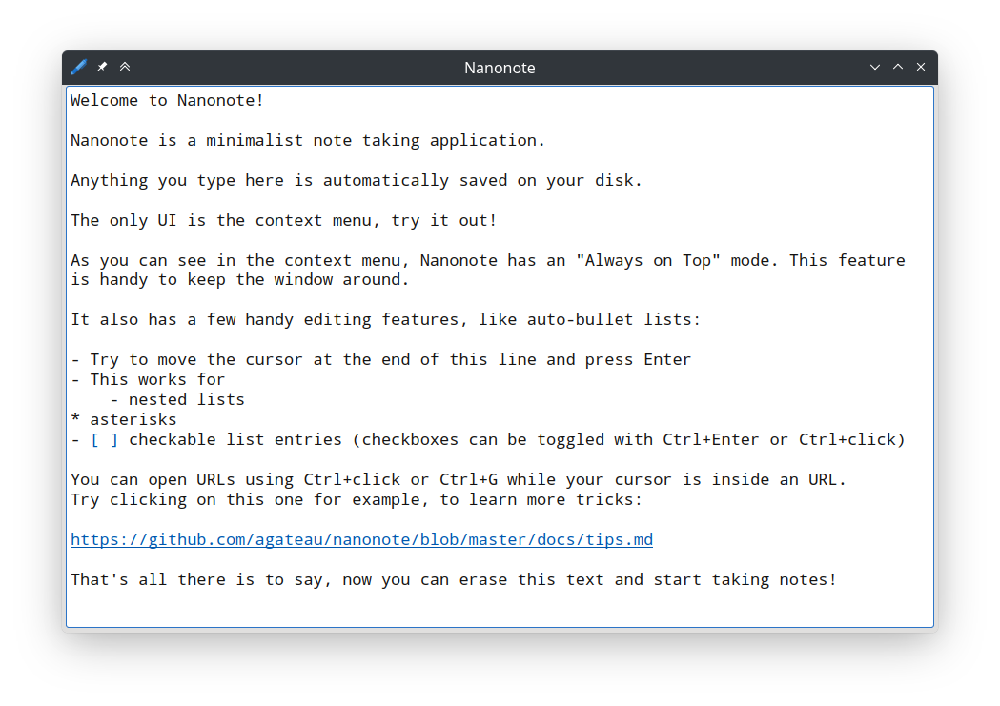

# Nanonote

Nanonote is a minimalist note taking application meant for short-lived notes.

It automatically saves anything you type in the screen on your disk. Being
minimalist means it has no synchronisation, does not support multiple
documents, images or any advanced formatting (the only formatting is
highlighting urls). If you have long-lived notes you should store them in a
more permanent place.

It is developed and tested on Linux. I expect it to work on macOS and Windows
as well, but haven't tested it. If you give it a try, let me know how it goes.

## Packages

Binary packages are available on the [release page][].

[release page]: https://github.com/agateau/nanonote/releases

## Building it

Nanonote requires Qt 5 and CMake. To build it, do the following:

Get the source:

    git clone https://github.com/agateau/nanonote
    cd nanonote
    git submodule update --init

Install [qpropgen](https://github.com/agateau/qpropgen) requirements:

    pip3 install -r qpropgen/requirements.txt

Build Nanonote:

    mkdir build
    cd build
    cmake ..
    make
    sudo make install

You can also build rpm and deb files using `make package` after `make`.
